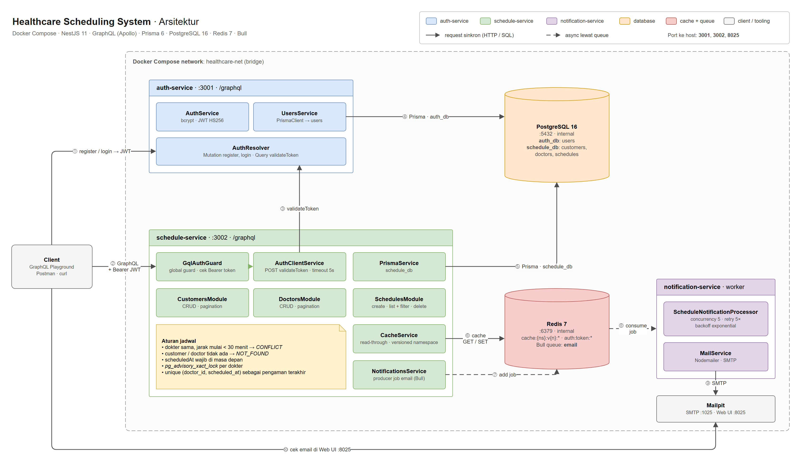

# Healthcare Scheduling System

Backend untuk mengatur jadwal konsultasi di klinik. Admin mencatat pasien dan dokter, lalu membuat jadwal konsultasi yang otomatis ditolak kalau bentrok. Terdiri dari dua service NestJS + GraphQL (auth dan schedule) yang jalan di Docker, ditambah worker untuk email notifikasi.

| Komponen | Teknologi |
| --- | --- |
| Framework | NestJS 11 (TypeScript) |
| API | GraphQL (code-first, Apollo Server) |
| Database | PostgreSQL 16 |
| ORM | Prisma 6 |
| Container | Docker & Docker Compose |
| Bonus | Redis (cache + queue), Bull, Nodemailer, Mailpit, Jest |

## Daftar isi

- [Arsitektur](#arsitektur)
- [Cara menjalankan](#cara-menjalankan)
- [Environment variables](#environment-variables)
- [Contoh GraphQL queries & mutations](#contoh-graphql-queries--mutations)
- [Aturan bisnis & keputusan desain](#aturan-bisnis--keputusan-desain)
- [Testing](#testing)
- [Struktur project](#struktur-project)
- [Fitur bonus](#fitur-bonus)

## Arsitektur



Sumber diagram: [`docs/architecture.drawio`](docs/architecture.drawio). File ini bisa dibuka dan diedit di [app.diagrams.net](https://app.diagrams.net).

| No | Alur | Jenis |
| --- | --- | --- |
| 1 | Client register / login ke `auth-service` dan mendapat JWT | sinkron |
| 2 | Client memanggil `schedule-service` dengan header `Authorization: Bearer <JWT>` | sinkron |
| 3 | `GqlAuthGuard` lewat `AuthClientService` memvalidasi token ke query `validateToken` | sinkron |
| 4 | `auth-service` membaca/menulis tabel `users` di `auth_db` | sinkron |
| 5 | `schedule-service` membaca/menulis `customers`, `doctors`, `schedules` di `schedule_db` | sinkron |
| 6 | Hasil query dan validasi token di-cache di Redis | sinkron |
| 7 | Setelah jadwal dibuat/dihapus, job email masuk ke queue Bull `email` | async |
| 8 | `notification-service` mengambil job dari queue | async |
| 9 | Email dikirim lewat SMTP ke Mailpit | sinkron |
| 10 | Email bisa dilihat di Web UI Mailpit `http://localhost:8025` | sinkron |

### Pembagian tugas

| Service | Tanggung jawab | Data |
| --- | --- | --- |
| `auth-service` | Registrasi, login (JWT), validasi token untuk service lain | `auth_db.users` |
| `schedule-service` | CRUD customer & doctor, membuat/menghapus jadwal, cek bentrok jadwal. Semua operasi wajib terautentikasi. | `schedule_db.customers`, `doctors`, `schedules` |
| `notification-service` (bonus) | Worker yang mengambil job dari queue Bull dan mengirim email ke customer | – |

Setiap service punya database sendiri (*database-per-service*) di satu instance PostgreSQL, dan tidak ada service yang membaca database milik service lain. Antar service hanya berkomunikasi lewat API (GraphQL) dan queue.

### Autentikasi antar service

1. Client mengirim request ke Schedule Service dengan header `Authorization: Bearer <token>`.
2. Guard global di Schedule Service memanggil query `validateToken` milik Auth Service.
3. Jika valid, request diteruskan ke resolver. Jika tidak, request ditolak dengan error `UNAUTHENTICATED`.

Hasil validasi di-cache di Redis maksimal 60 detik (dan tidak pernah lebih lama dari masa berlaku token). Kunci cache berupa hash SHA-256 dari token, bukan token-nya.

## Cara menjalankan

### Prasyarat

- Docker dan Docker Compose v2
- Port `3001`, `3002`, dan `8025` di host belum terpakai. PostgreSQL dan Redis tidak di-publish ke host, jadi tidak bentrok dengan instalasi lokal.

### Langkah

```bash
git clone <url-repository> healthcare-scheduling
cd healthcare-scheduling

# 1. Buat file konfigurasi, lalu ganti POSTGRES_PASSWORD dan JWT_SECRET
cp .env.example .env
#    contoh membuat secret: openssl rand -hex 32

# 2. Build & jalankan semua container
docker compose up --build
```

Saat container start, migrasi Prisma dijalankan otomatis (`prisma migrate deploy`). Kedua database dibuat oleh [`docker/postgres/init/01-create-databases.sql`](docker/postgres/init/01-create-databases.sql) saat volume PostgreSQL pertama kali diinisialisasi.

| URL | Keterangan |
| --- | --- |
| http://localhost:3001/graphql | Auth Service: GraphQL Playground & endpoint |
| http://localhost:3002/graphql | Schedule Service: GraphQL Playground & endpoint |
| http://localhost:8025 | Mailpit: kotak masuk email notifikasi |
| http://localhost:3001/health, http://localhost:3002/health | Health check (dipakai `HEALTHCHECK` Docker) |

> Di Playground Schedule Service, isi tab **HTTP HEADERS** dengan
> `{ "Authorization": "Bearer <accessToken dari login>" }`.

Menghentikan & membersihkan:

```bash
docker compose down        # stop container
docker compose down -v     # stop + hapus data PostgreSQL & Redis
```

### Menjalankan service di host (opsional, untuk development)

```bash
# Infrastruktur di Docker, dengan port di-publish ke host
docker compose -f docker-compose.yml -f docker-compose.dev.yml up -d postgres redis mailpit

# Di setiap folder service (auth-service, schedule-service, notification-service):
cp .env.example .env              # sesuaikan password DB & JWT_SECRET
npm ci
npx prisma generate && npx prisma migrate deploy   # khusus auth-service & schedule-service
npm run start:dev
```

## Environment variables

Untuk Docker Compose, semua nilai dibaca dari file `.env` di root (lihat [`.env.example`](.env.example)). Variabel yang wajib diisi ditandai **wajib**; sisanya punya default. Setiap service mengecek konfigurasinya saat start. Kalau ada nilai yang kosong atau salah, service berhenti dan menyebutkan nama variabelnya.

**Root `.env` (docker-compose)**

| Variabel | Default | Keterangan |
| --- | --- | --- |
| `POSTGRES_USER` | **wajib** | User PostgreSQL |
| `POSTGRES_PASSWORD` | **wajib** | Password PostgreSQL. Hindari karakter `@ : / ? # %` karena dipakai di URL koneksi. |
| `JWT_SECRET` | **wajib** | Secret penandatangan JWT, minimal 32 karakter |
| `MAILPIT_UI_HOST_PORT` | `8025` | Port host untuk UI Mailpit |

**auth-service**

| Variabel | Default | Keterangan |
| --- | --- | --- |
| `PORT` | `3001` | Port HTTP |
| `DATABASE_URL` | **wajib** | URL koneksi PostgreSQL (`auth_db`). Di Compose disusun otomatis. |
| `JWT_SECRET` | **wajib** | Minimal 32 karakter |
| `JWT_EXPIRES_IN` | `3600` | Masa berlaku access token (detik, minimal 60) |
| `BCRYPT_SALT_ROUNDS` | `10` | Cost factor bcrypt (10–15) |
| `GRAPHQL_PLAYGROUND` | `true` | Aktifkan Playground & introspection |

**schedule-service**

| Variabel | Default | Keterangan |
| --- | --- | --- |
| `PORT` | `3002` | Port HTTP |
| `DATABASE_URL` | **wajib** | URL koneksi PostgreSQL (`schedule_db`). Di Compose disusun otomatis. |
| `AUTH_SERVICE_URL` | **wajib** | Base URL Auth Service, mis. `http://auth-service:3001` |
| `AUTH_REQUEST_TIMEOUT_MS` | `5000` | Timeout panggilan `validateToken` |
| `AUTH_CACHE_TTL_SECONDS` | `60` | TTL cache hasil validasi token (`0` = nonaktif) |
| `REDIS_HOST` / `REDIS_PORT` / `REDIS_PASSWORD` | `localhost` / `6379` / – | Koneksi Redis (cache & queue) |
| `CACHE_TTL_SECONDS` | `60` | TTL cache query (`0` = nonaktif) |
| `SCHEDULE_DURATION_MINUTES` | `30` | Durasi satu konsultasi, dipakai untuk cek bentrok |
| `GRAPHQL_PLAYGROUND` | `true` | Aktifkan Playground & introspection |

**notification-service**

| Variabel | Default | Keterangan |
| --- | --- | --- |
| `REDIS_HOST` / `REDIS_PORT` / `REDIS_PASSWORD` | `localhost` / `6379` / – | Koneksi Redis (queue) |
| `SMTP_HOST` / `SMTP_PORT` | `mailpit` / `1025` di Compose | Server SMTP |
| `SMTP_SECURE` | `false` | `true` untuk TLS langsung (biasanya port 465) |
| `SMTP_USER` / `SMTP_PASSWORD` | – | Kredensial SMTP (kosongkan untuk Mailpit) |
| `MAIL_FROM` | `Healthcare Clinic <no-reply@healthcare.local>` | Pengirim email |
| `APP_TIMEZONE` | `Asia/Jakarta` | Zona waktu (IANA) untuk menampilkan jam konsultasi di email |
| `QUEUE_CONCURRENCY` | `5` | Jumlah email yang diproses paralel |

## Contoh GraphQL queries & mutations

Collection Postman siap pakai ada di [`docs/healthcare-scheduling.postman_collection.json`](docs/healthcare-scheduling.postman_collection.json). Request **Login** otomatis menyimpan token, dan request *create* otomatis menyimpan ID ke variabel collection. Urutan request sudah disusun agar collection bisa dijalankan dari atas ke bawah. Schema lengkap (beserta deskripsi setiap field) ada di [`docs/auth-service.schema.graphql`](docs/auth-service.schema.graphql) dan [`docs/schedule-service.schema.graphql`](docs/schedule-service.schema.graphql).

### Auth Service: `http://localhost:3001/graphql`

```graphql
mutation Register {
  register(input: { email: "admin@clinic.test", password: "supersecret1" }) {
    id
    email
    createdAt
  }
}

mutation Login {
  login(input: { email: "admin@clinic.test", password: "supersecret1" }) {
    accessToken
    tokenType
    expiresIn
    user { id email }
  }
}

query ValidateToken {
  validateToken(token: "<accessToken>") {
    id
    email
  }
}
```

### Schedule Service: `http://localhost:3002/graphql`

Semua operasi butuh header `Authorization: Bearer <accessToken>`.

```graphql
mutation CreateCustomer {
  createCustomer(input: { name: "Jane Doe", email: "jane.doe@example.com" }) {
    id
    name
    email
  }
}

mutation UpdateCustomer {
  updateCustomer(id: "<customerId>", input: { name: "Jane A. Doe" }) {
    id
    name
    updatedAt
  }
}

query Customers {
  customers(page: 1, limit: 10) {
    items { id name email }
    pageInfo { total page limit totalPages hasNextPage hasPreviousPage }
  }
}

query Customer {
  customer(id: "<customerId>") { id name email createdAt updatedAt }
}

mutation DeleteCustomer {
  deleteCustomer(id: "<customerId>") { id name }
}

mutation CreateDoctor {
  createDoctor(input: { name: "Dr. Gregory House" }) { id name }
}

mutation UpdateDoctor {
  updateDoctor(id: "<doctorId>", input: { name: "Dr. G. House" }) { id name }
}

query Doctors {
  doctors(page: 1, limit: 10) {
    items { id name }
    pageInfo { total totalPages }
  }
}

query Doctor {
  doctor(id: "<doctorId>") { id name }
}

mutation DeleteDoctor {
  deleteDoctor(id: "<doctorId>") { id name }
}

mutation CreateSchedule {
  createSchedule(
    input: {
      objective: "Annual check-up"
      customerId: "<customerId>"
      doctorId: "<doctorId>"
      scheduledAt: "2030-01-15T02:00:00.000Z"
    }
  ) {
    id
    objective
    scheduledAt
    customer { name email }
    doctor { name }
  }
}

query Schedules {
  schedules(
    filter: {
      doctorId: "<doctorId>"
      customerId: "<customerId>"
      from: "2030-01-01T00:00:00.000Z"
      to: "2030-12-31T23:59:59.999Z"
    }
    page: 1
    limit: 10
  ) {
    items { id objective scheduledAt customer { name } doctor { name } }
    pageInfo { total page totalPages }
  }
}

query Schedule {
  schedule(id: "<scheduleId>") {
    id
    objective
    scheduledAt
    customer { id name email }
    doctor { id name }
  }
}

mutation DeleteSchedule {
  deleteSchedule(id: "<scheduleId>") { id scheduledAt }
}
```

Semua filter `schedules` bersifat opsional dan digabung dengan AND. Hasil diurutkan berdasarkan `scheduledAt`. List customer & doctor diurutkan dari yang terbaru. `limit` maksimal 100.

### Format error

Setiap error punya `extensions.code`, jadi client bisa membedakan jenis error tanpa membaca isi pesan:

```json
{
  "errors": [
    {
      "message": "Doctor already has a consultation at 2030-01-15T02:00:00.000Z (consultations last 30 minutes)",
      "path": ["createSchedule"],
      "extensions": { "code": "CONFLICT", "statusCode": 409 }
    }
  ],
  "data": null
}
```

| `code` | Kapan |
| --- | --- |
| `UNAUTHENTICATED` | Token tidak ada / tidak valid / kedaluwarsa, atau login gagal |
| `BAD_REQUEST` | Input tidak valid. Pesan per field ada di `extensions.details`. |
| `NOT_FOUND` | Customer / doctor / schedule tidak ditemukan |
| `CONFLICT` | Email sudah terpakai, jadwal bentrok, atau menghapus customer/doctor yang masih punya jadwal |
| `SERVICE_UNAVAILABLE` | Auth Service tidak dapat dihubungi |
| `INTERNAL_SERVER_ERROR` | Error tak terduga. Detailnya hanya dicatat di log, tidak dikirim ke client. |

## Aturan bisnis & keputusan desain

**Jadwal bentrok.** Satu konsultasi dianggap berlangsung selama `SCHEDULE_DURATION_MINUTES` (default 30 menit). Jadwal baru ditolak (`CONFLICT`) jika dokter yang sama sudah punya jadwal yang mulai kurang dari 30 menit sebelum atau sesudahnya. Jadwal yang persis berurutan (09:00 lalu 09:30) diperbolehkan. Dokter berbeda pada jam yang sama juga diperbolehkan.

**Aman terhadap request bersamaan.** Cek bentrok dan insert dilakukan dalam satu transaksi yang memegang `pg_advisory_xact_lock` per dokter. Dua request paralel untuk dokter yang sama diproses bergantian, sehingga tidak mungkin keduanya lolos. Unique index `(doctor_id, scheduled_at)` menjadi lapis pengaman terakhir. Saat diuji, 5 booking paralel di slot yang sama menghasilkan 1 sukses dan 4 `CONFLICT`.

**Validasi relasi.** `customerId` dan `doctorId` dicek di dalam transaksi yang sama (`NOT_FOUND` jika tidak ada). `scheduledAt` harus di masa depan.

**Penghapusan.** Foreign key memakai `ON DELETE RESTRICT`: customer/doctor yang masih punya jadwal tidak bisa dihapus (`CONFLICT`). Tujuannya supaya riwayat konsultasi tidak ikut terhapus. Hapus jadwalnya dulu; customer akan menerima email pembatalan.

**Email.** Email disimpan dalam bentuk huruf kecil dan di-trim, sehingga keunikan email tidak peka huruf besar/kecil. Pada `update*`, field yang tidak dikirim tidak berubah, sedangkan `null` eksplisit ditolak.

**Keamanan.**
- Password di-hash dengan bcrypt dan tidak pernah ada di schema GraphQL.
- Login dengan email yang tidak terdaftar tetap menjalankan bcrypt, sehingga waktu responsnya tidak membocorkan email mana yang terdaftar.
- JWT ditandatangani HS256 (algoritma lain ditolak). `validateToken` juga memastikan user pemilik token masih ada.
- Tidak ada secret yang di-commit: `.env` masuk `.gitignore`, dan Compose menolak start jika `JWT_SECRET`/`POSTGRES_PASSWORD` belum diisi.
- Container berjalan sebagai user non-root.

## Testing

```bash
cd auth-service && npm ci && npx prisma generate && npm run lint && npm run test:cov
cd schedule-service && npm ci && npx prisma generate && npm run lint && npm run test:cov
cd notification-service && npm ci && npm run lint && npm run test:cov
```

| Service | Tests | Coverage (lines) |
| --- | --- | --- |
| auth-service | 33 | 78.2% |
| schedule-service | 88 | 80.2% |
| notification-service | 17 | 85.7% |

Kode dicek ESLint (`typescript-eslint` type-checked) dan Prettier. Jest dipasang dengan `coverageThreshold` 50%, jadi `npm run test:cov` gagal kalau coverage turun di bawah angka itu. Unit test mencakup aturan bisnis (bentrok jadwal, validasi relasi, error mapping Prisma), guard & client autentikasi, cache (termasuk saat Redis mati), producer & consumer queue, template email (termasuk escaping HTML), dan validasi input/env.

Selain unit test, alur auth, CRUD, pagination, filter, bentrok jadwal, booking paralel, invalidasi cache, pengiriman email ke Mailpit, dan kondisi Redis mati juga sudah dicoba langsung ke stack Docker yang berjalan.

## Struktur project

```
healthcare-scheduling/
├── docker-compose.yml          # seluruh stack
├── docker-compose.dev.yml      # override: publish port infrastruktur untuk dev lokal
├── .env.example
├── docker/postgres/init/       # membuat auth_db & schedule_db
├── docs/                       # Postman collection + schema GraphQL
├── auth-service/
│   ├── Dockerfile
│   ├── prisma/                 # schema.prisma + migrations
│   └── src/
│       ├── auth/               # resolver, service, DTO (register/login/validateToken)
│       ├── users/              # akses data user
│       ├── common/             # format error GraphQL, helper Prisma
│       ├── config/             # validasi environment
│       ├── health/             # GET /health
│       └── prisma/
├── schedule-service/
│   ├── Dockerfile
│   ├── prisma/
│   └── src/
│       ├── auth/               # guard global + client validateToken
│       ├── cache/              # cache Redis dengan namespace versioning
│       ├── customers/          # module, resolver, service, DTO, model
│       ├── doctors/
│       ├── schedules/          # termasuk logika bentrok jadwal
│       ├── notifications/      # producer job email (Bull)
│       ├── common/             # pagination, format error, transform input
│       ├── config/
│       ├── health/
│       └── prisma/
└── notification-service/
    ├── Dockerfile
    └── src/
        ├── notifications/      # consumer Bull + template email
        ├── mail/               # transport SMTP (Nodemailer)
        └── config/
```

## Fitur bonus

| Fitur | Implementasi |
| --- | --- |
| **Email notification** | Customer menerima email saat jadwal dibuat (`Consultation booked with …`) dan saat dihapus (`Consultation … cancelled`), dengan jam yang ditampilkan dalam `APP_TIMEZONE`. Buka http://localhost:8025 untuk melihatnya. |
| **Queue system (Bull)** | `schedule-service` hanya memasukkan job ke queue `email`. `notification-service` memprosesnya dengan retry 5× (exponential backoff). Kalau queue atau SMTP bermasalah, operasi jadwal tetap berhasil. |
| **Redis caching** | Read-through cache untuk `customer(s)`, `doctor(s)`, `schedule(s)` dan hasil `validateToken`. Invalidasi memakai *namespace versioning*: setiap mutasi menaikkan versi namespace, sehingga semua entri lama langsung tidak terpakai tanpa perlu `KEYS`/`SCAN`. Update customer/doctor juga meng-invalidasi cache schedule karena schedule menyertakan data keduanya. Jika Redis mati, service tetap berjalan tanpa cache. |
| **Unit testing** | 138 test, coverage line di atas 78% untuk setiap service. `test:cov` gagal kalau di bawah 50%. |
| **API documentation** | GraphQL Playground aktif di kedua service. Setiap type, field, argumen, query, dan mutation punya deskripsi, termasuk error yang bisa muncul. SDL hasil ekspor ada di `docs/`. |
